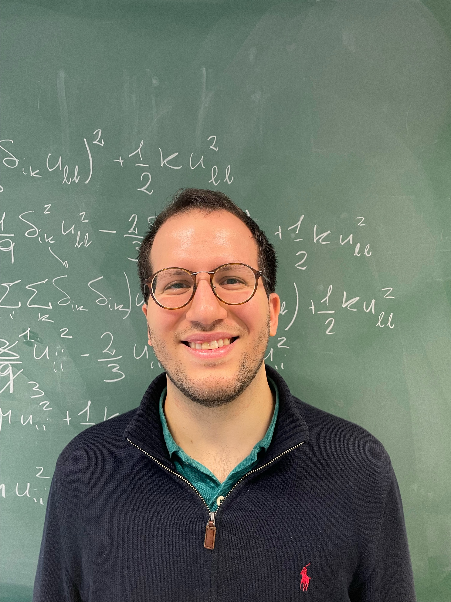

# Giovanni Russo

PhD student in theoretical and computational statistical physics  
LPTMS, Université Paris-Saclay, CNRS  
PMMH, ESPCI Paris, Université PSL, Sorbonne Université, Université Paris Cité, CNRS 

I work on the statistical physics of disordered systems, with a focus on driven elastic interfaces, finite-temperature creep, depinning, and amorphous plasticity.

My current research combines numerical simulations, kinetic Monte Carlo methods, scaling analysis, and theoretical ideas from out-of-equilibrium statistical physics.

## Links

- [Research](research.md)
- [Publications](publications.md)
- [Talks](talks.md)
- [Code](code.md)
- [CV](cv.md)

## External links

- [GitHub](https://github.com/giov-russo)
- [arXiv](https://arxiv.org/abs/2604.17600)
