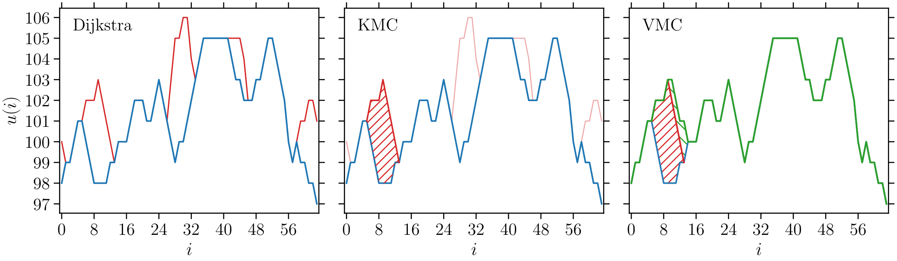

# Research

My research lies at the interface between statistical physics, disordered systems, and numerical simulations. I am interested in how collective dynamics emerges in driven systems with disorder, from elastic interfaces in random media to amorphous solids under deformation.

A recurring theme in my work is the relation between rare local rearrangements and large-scale collective response: thermal activations, deterministic avalanches, localization, and finite-size scaling.

## Driven elastic interfaces

I study the dynamics of driven elastic interfaces in random media, with a particular focus on the finite-temperature creep regime below the depinning threshold.

In this regime, motion is extremely slow and proceeds through rare thermally activated events followed by deterministic relaxation. My recent work focuses on the separation between two distinct length scales: the thermal activation nucleus, which controls the Arrhenius timescale, and the avalanche scale, which controls spatial correlations after activation.

  

  <em>Effective finite-temperature creep dynamics: candidate activated rearrangements are identified by a Dijkstra-type search, one event is selected through kinetic Monte Carlo, and the interface then relaxes deterministically to a new metastable state.</em>

This effective dynamics provides a way to separate the activation event from the deterministic avalanche it triggers. It is particularly useful for studying spatial correlations, roughness crossovers, and dynamical heterogeneities in the creep regime.

## Amorphous plasticity

I also work on coarse-grained elastoplastic models of amorphous solids. These models describe plastic deformation as a sequence of local rearrangements coupled by long-range elastic interactions.

I am interested in how mesoscopic rules, disorder, thermal activation, and mechanical noise shape the macroscopic flow of amorphous materials. Current directions include softening, localization, shear banding, and thermally activated plastic dynamics.

## Methods

My work combines numerical simulations and scaling analysis, with methods including:

- kinetic Monte Carlo algorithms;
- extremal dynamics;
- deterministic relaxation algorithms;
- finite-size scaling;
- roughness and structure-factor analysis;
- dynamical correlation functions;
- Python-based data analysis;
- high-performance computing workflows.
